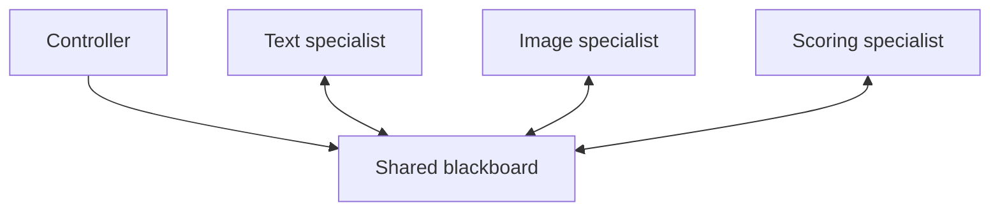
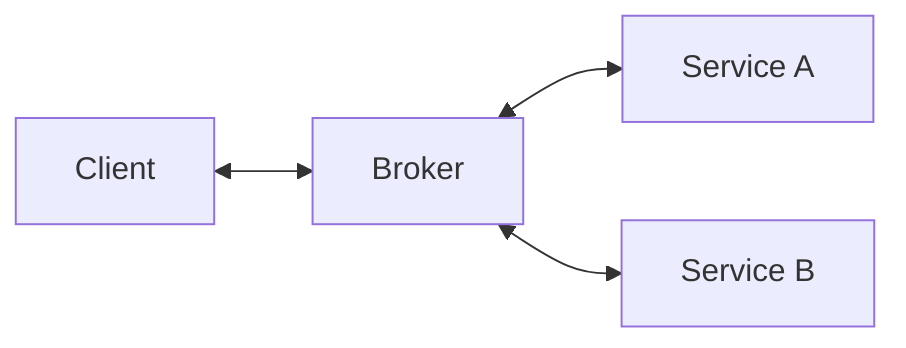
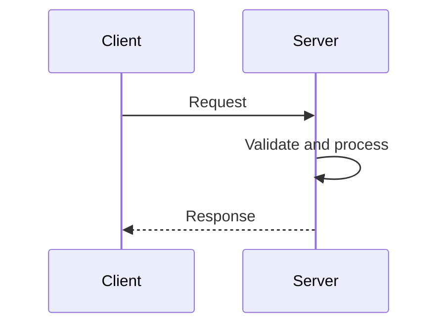
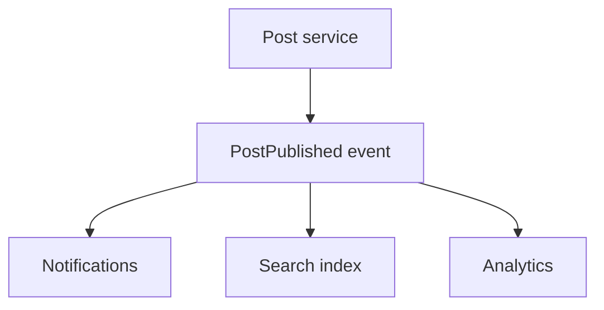
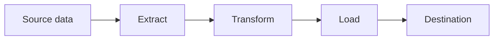
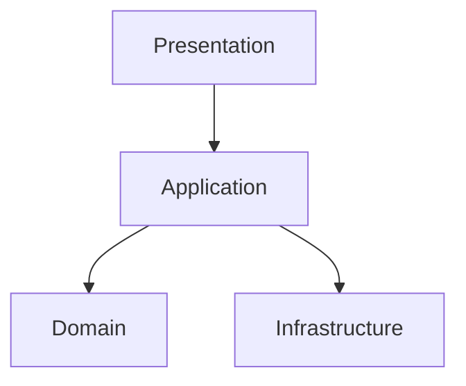
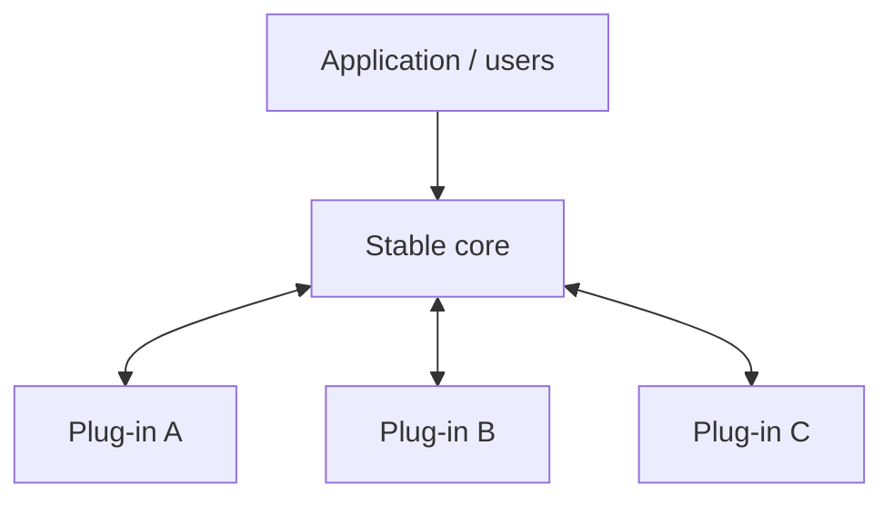

# Architectural Design Patterns — Part I

Architectural patterns describe the large-scale shape of a system: its major parts, what responsibilities those parts have, and how information moves between them.

That makes them different from the Gang of Four patterns. A GoF pattern usually helps organize a group of classes or objects inside an application. An architectural pattern can influence the boundaries of the entire application—or even a collection of separately deployed applications.

> A useful shortcut: a design pattern helps answer **"How should these objects collaborate?"** An architectural pattern helps answer **"What are the major parts of this system, and how should they collaborate?"**

These categories can overlap. An event-driven architecture may use Observer inside one service. A layered application may use Strategy, Factory, and Repository classes. Architectural patterns and object-oriented patterns operate at different zoom levels rather than competing with each other.

## At a glance

| Pattern | Central idea | Useful when | Main danger |
| --- | --- | --- | --- |
| [Blackboard](#blackboard-pattern) | Independent specialists contribute partial solutions to shared knowledge | No single algorithm can solve the whole problem cleanly | Coordination and debugging become difficult |
| [Broker](#broker-pattern) | An intermediary locates services and carries requests between distributed components | Callers and services should not know each other's locations or protocols | The broker can become a bottleneck or failure point |
| [Client–Server](#clientserver-pattern) | Clients request capabilities owned by a server | Many clients need shared data, rules, or services | Too much responsibility can accumulate on the server |
| [Event-Driven](#event-driven-pattern) | Components publish facts; other components react | Workflows need loose coupling, extensibility, or asynchronous processing | Event order, duplication, and tracing are hard |
| [ETL](#extracttransformload-etl-pattern) | Extract data, reshape it, and load it into a destination | Data must move between systems or support analytics | Bad or late source data contaminates downstream results |
| [Layered](#layered-pattern) | Organize responsibilities into levels with controlled dependencies | A system benefits from clear separation of UI, business rules, and data access | Layers can become ceremony or leak into each other |
| [Leader–Worker / Primary–Replica](#leadersworkers-and-primaryreplicas) | One component coordinates work or owns writes; others perform work or copy state | Work can be parallelized or data needs redundant readers | Coordinator failure, replication lag, and uneven work |
| [Microkernel](#microkernel-pattern) | Keep a stable core and add optional capabilities as plug-ins | Products need many extensions or customer-specific features | Plug-in contracts and version compatibility become complex |

## Blackboard pattern

### The idea

Imagine a room containing a shared whiteboard and several specialists. Each specialist watches the board. When one recognizes something it can improve, it adds a partial result. That new information may allow another specialist to contribute. The system advances through cooperation rather than one fixed sequence of steps.

The usual parts are:

- **Blackboard:** shared problem state and partial results.
- **Knowledge sources:** independent specialists, rules, or algorithms.
- **Controller:** decides which specialist should run next, or provides the mechanism that lets specialists react.

### Example

A document-understanding system might place raw text, detected headings, images, and confidence scores on the blackboard. One component identifies entities, another detects relationships, and another assembles a structured explanation. Each works with whatever evidence currently exists.

### When it fits

Use Blackboard when:

- several different techniques can contribute to a solution;
- the order of useful contributions cannot be fully predicted;
- partial solutions are valuable;
- the problem is exploratory, interpretive, or inference-heavy.

Common examples include speech recognition, computer vision, planning systems, diagnosis, and some multi-agent or AI pipelines.

### Tradeoffs

The pattern is flexible, but the control flow becomes implicit. It may be difficult to explain why a particular result appeared, reproduce timing-sensitive behavior, or prevent two specialists from repeatedly triggering each other.

### Atlas connection

A future Atlas analysis feature could treat a complex public issue as shared evolving knowledge. Independent analyzers might add summaries, contradictions, evidence quality, related issues, or suggested questions. The important distinction is that ordinary users editing shared posts is not automatically Blackboard; the pattern appears when autonomous knowledge sources inspect and improve a common problem representation.

## Broker pattern

### The idea

A broker sits between clients that want a capability and servers that provide it. The client asks the broker rather than locating and communicating with a particular server directly. The broker may handle discovery, routing, serialization, transport, retries, or response delivery.

Examples include message brokers, RPC middleware, service buses, and object request brokers.

### Broker versus Mediator

These can look similar because both put something in the middle.

- **Mediator** coordinates the behavior of collaborating objects, usually to reduce many direct object-to-object relationships.
- **Broker** connects distributed requesters with providers and often hides location, transport, or protocol details.

A chat-room object coordinating users is a classic Mediator. A message broker routing a notification request to an available notification service is architectural Broker.

### Tradeoffs

A broker reduces coupling and makes services easier to relocate or replace. It also introduces infrastructure, latency, operational complexity, and a central place whose failure can affect many interactions. Production brokers therefore need redundancy and careful delivery semantics.

## Client–Server pattern

### The idea

Clients initiate requests; a server owns and supplies a shared capability. A browser calling a web API is the familiar example, but the pattern also includes desktop database clients, mobile apps, game clients, and network file servers.

The defining feature is the division of responsibility, not HTTP. A client focuses on interaction or consumption; the server centralizes data, rules, security, or expensive work.

### Atlas connection

Atlas already has a natural client–server shape: the frontend displays and edits the graph, while the backend authenticates users, applies authorization and domain rules, stores posts and relationships, and serves shared state.

WebSockets do not stop it from being client–server. They merely allow the server to initiate messages over an established connection. The same system can simultaneously be client–server at the broad level and event-driven for real-time updates.

### Tradeoffs

Centralization makes consistency, updates, and security easier, but a server can become overloaded or unavailable. Caching, replication, horizontal scaling, and graceful offline behavior address those risks, though each adds complexity.

## Event-Driven pattern

### The idea

A producer announces that something happened without directly commanding every interested consumer. Consumers subscribe to relevant event types and react independently.

For example, after an Atlas post is published, the core operation might emit `PostPublished`. Separate consumers could update a search index, notify followers, create analytics records, and refresh graph projections.

### Event-Driven versus Observer

Observer is often an in-process object pattern with direct or near-direct notification. Event-driven architecture applies the same broad publish/react idea across larger boundaries, frequently using queues or streams, asynchronous execution, durable messages, and separately deployed services.

### Important concepts

- **Event:** a past-tense fact, such as `CommentAdded`.
- **Command:** a request for something to happen, such as `SendDigest`.
- **At-most-once delivery:** an event may be lost but is not repeated.
- **At-least-once delivery:** an event should arrive, but consumers must tolerate duplicates.
- **Idempotency:** processing the same event twice has the same practical effect as processing it once.
- **Eventual consistency:** different views of the system may temporarily disagree while events propagate.

### Tradeoffs

Producers and consumers become independently extensible, and slow work can happen asynchronously. The cost is less visible control flow. You need correlation IDs, structured logs, dead-letter handling, retries, idempotent consumers, and a clear event schema/versioning policy.

## Extract–Transform–Load (ETL) pattern

### The idea

ETL is a data pipeline with three conceptual stages:

1. **Extract** data from source systems.
2. **Transform** it into the required shape, quality, units, or meaning.
3. **Load** it into a destination such as a warehouse, database, or search system.

A simple example is importing survey responses from CSV files, standardizing dates and categories, removing invalid rows, calculating derived fields, and loading the results into an analytics database.

### ETL versus ELT

In **ETL**, transformation happens before loading into the destination. In **ELT**, raw data is loaded first and transformed using the destination platform. Modern warehouses often favor ELT because they have substantial compute capacity and retaining raw data makes reprocessing easier.

### Tradeoffs

ETL makes data integration repeatable and auditable, but pipelines can silently turn source defects into trusted-looking reports. Preserve lineage: record where fields came from, when extraction occurred, which transformation version ran, and what was rejected.

For Atlas, ETL could support research datasets, analytics, moderation reports, or search indexing. It would not normally handle a user's immediate create-post request; that belongs to the transactional application path.

## Layered pattern

### The idea

A layered architecture groups responsibilities and restricts the direction of dependency. A common web application uses:

1. **Presentation layer** — HTTP controllers or UI-facing endpoints.
2. **Application layer** — coordinates use cases.
3. **Domain layer** — contains core concepts and business rules.
4. **Infrastructure/data layer** — databases, file systems, email, external APIs.

The exact names matter less than keeping responsibilities clear. A controller should not contain a page of SQL and voting mathematics. A domain object should not need to know which web framework received the request.

### Strict and relaxed layers

- In a **strict** layered architecture, each layer calls only the layer immediately below it.
- In a **relaxed** layered architecture, a higher layer may skip layers when appropriate.

Strict layering gives stronger boundaries; relaxed layering avoids useless pass-through code. The right choice depends on whether the boundary protects real complexity or merely adds ceremony.

### Tradeoffs

Layers make systems easier to understand and test when the separations reflect genuine responsibilities. They become harmful when every operation requires many nearly empty classes, or when abstractions leak and business logic drifts into controllers and repositories.

### Atlas connection

Atlas is a strong candidate for meaningful layers because voting, recursive issue relationships, permissions, comments, and graph behavior are domain concerns. Keeping those rules separate from React/D3 presentation and persistence technology would make future UI and infrastructure changes safer.

## Leaders/workers and primary/replicas

The chapter's term **master–slave** is older terminology. Modern documentation generally uses more precise names because the original label is both unnecessarily loaded and ambiguous.

### Leader–worker processing

A leader divides or schedules work; workers process tasks, often in parallel; the leader combines results or tracks completion.

Examples include rendering many image tiles, processing uploaded files, crawling pages, or running independent calculations. This improves throughput when work can be divided, but requires retry handling, load balancing, and protection against the leader becoming a single point of failure.

### Primary–replica data

A primary database accepts writes and propagates changes to replicas. Replicas may serve reads or stand by for failover.

This improves read capacity and availability, but replicas may lag. A user might update a profile and then briefly read the old value from a replica. Failover also requires a reliable way to choose exactly one writable primary; otherwise a split-brain condition can produce conflicting writes.

These are related coordination shapes, but they solve different problems. Asking whether the system is distributing **work** or replicating **state** prevents the terminology from hiding that distinction.

## Microkernel pattern

### The idea

A microkernel architecture keeps the essential, stable behavior in a small core and supplies optional or changeable behavior through plug-ins.

Operating systems inspired the name, but the pattern also appears in IDEs, browsers, build tools, workflow engines, and products with customer-specific modules.

For example, an IDE core can own documents, commands, and extension lifecycle while language plug-ins add Java, Python, or TypeScript intelligence.

### Atlas connection

Atlas's planned post builder could eventually take a microkernel-like shape. A stable post/document core might define blocks, ordering, editing, validation, and serialization. Plug-ins could supply text, image, video, poll, chart, or dataset blocks. This is especially useful if third parties or separately developed modules may add block types.

It is not automatically Microkernel merely because code has components. The core must intentionally expose a stable extension contract and remain useful while optional capabilities come and go.

### Tradeoffs

Microkernel supports extensibility and product variation, but the plug-in API becomes a long-term commitment. Versioning, permissions, isolation, discovery, failure containment, and compatibility testing all become architectural concerns.

## How patterns combine

A real system rarely chooses exactly one pattern.

Atlas could reasonably be:

- **Client–server** at its broadest deployment boundary;
- **Layered** inside the backend;
- **Event-driven** for notifications, indexing, and real-time projections;
- **Microkernel-like** for extensible post block types;
- supported by **ETL** pipelines for research and analytics;
- connected through a **broker** if asynchronous services multiply.

This does not mean more patterns are automatically better. Each pattern should pay rent by solving a real problem. Architecture becomes harder when patterns are adopted for prestige rather than a concrete need.

## A practical selection checklist

Before choosing a pattern, ask:

1. What pressure is forcing the design to change—scale, extensibility, availability, data integration, or team boundaries?
2. Which responsibilities need to vary independently?
3. Must communication be synchronous, or can the result arrive later?
4. Where must data be immediately consistent?
5. What happens when one component is slow, duplicated, or unavailable?
6. How will a developer trace one user action across the system?
7. What is the simplest architecture that meets today's needs without blocking the most likely next step?

The diagram is not the architecture. The important part is the set of decisions and tradeoffs the diagram represents.
