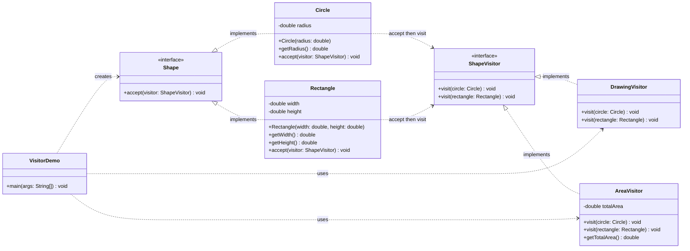

# Visitor Pattern

## Intent

Add new operations to a stable group of object types without putting every operation inside those objects.

## Demo

This example has two shape types, `Circle` and `Rectangle`. Instead of giving each shape every possible operation, the operations live in visitors:

- `DrawingVisitor` knows how to draw each shape.
- `AreaVisitor` calculates and accumulates each shape's area.

Every shape implements `accept(ShapeVisitor)`. Inside `accept`, the shape calls the visitor's overload for its own concrete type. This two-step dispatch lets Java choose behavior based on both the visitor and the shape.

## Key idea

> The object structure owns the data; visitors supply operations over that structure.

Visitor is especially useful when the element types rarely change but you frequently add new operations, such as exporting, reporting, validation, or analysis.

## Structure

- `Shape` — element interface declaring `accept`.
- `Circle` and `Rectangle` — concrete elements.
- `ShapeVisitor` — declares one `visit` overload for each concrete element type.
- `DrawingVisitor` and `AreaVisitor` — separate operations applied to the shapes.
- `VisitorDemo` — sends multiple visitors through the same collection.

## Mermaid class diagram

GitHub renders this diagram directly. In VS Code, open this README and use **Markdown: Open Preview** (`Ctrl+Shift+V` on Windows/Linux).



The diagram separates the two dimensions of the pattern:

- the `Shape` element hierarchy
- the `ShapeVisitor` operation hierarchy

The `accept then visit` dependencies highlight the double-dispatch step.

### PlantUML version

The original PlantUML source remains available in [`visitor-class-diagram.puml`](visitor-class-diagram.puml). To preview it in VS Code, install the **PlantUML** extension by jebbs, open the `.puml` file, and run **PlantUML: Preview Current Diagram** from the Command Palette. The usual keyboard shortcut is `Alt+D`.

## The double-dispatch step

The call sequence is:

1. client calls `shape.accept(visitor)`
2. the concrete shape calls `visitor.visit(this)`
3. Java selects the matching `visit(Circle)` or `visit(Rectangle)` method

That second call is what gives the visitor access to the concrete shape type without using `instanceof` checks.

## Tradeoffs

### Advantages

- new operations can be added as new visitor classes
- related behavior stays together instead of being spread across element classes
- one visitor can accumulate information across an entire object structure

### Disadvantages

- adding a new element type requires changing every visitor
- visitors may need accessors that expose element details
- double dispatch can be unfamiliar at first

## Run

```bash
javac *.java
java VisitorDemo
```

Expected output:

```text
Drawing a circle with radius 2.0
Drawing a 3.0 x 4.0 rectangle
Total area: 24.57
```
